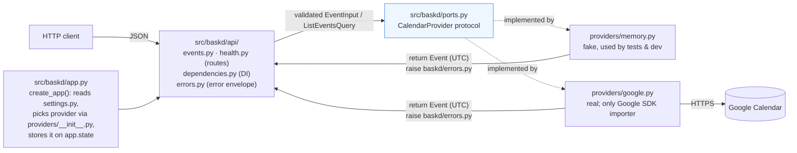

# AGENTS.md: how work moves through this repository

This file is for everyone who changes the code: teammates, reviewers, and coding agents
(Kiro, Copilot, Claude, ...). It records the development workflow the handout asks us to
define and follow, plus the conventions an agent needs to make a change that passes review
on the first try. When this document and reality disagree, fix the document in the same PR.

## 1. Selecting work

- **Everything is a GitHub Issue first.** Bugs use `.github/ISSUE_TEMPLATE/bug_report.md`,
  features use `feature_report.md`. An issue is ready to pick up when it has an owner, a
  rough size (S ≤ 2h, M ≤ 1 day, L = split it), a reviewer, and lists the issues it depends on.
- **The queue is continuously prioritised**, top to bottom, on the GitHub Projects board
  (columns: Backlog → Ready → In progress → In review → Verified → Released). Milestone
  due dates drive the ordering; anything the current milestone needs sits above anything it does not.
- **WIP limit: one "In progress" issue per person** (plus at most one review you owe).
  Finish or hand off before starting the next.
- **Urgent work** (prod broken, demo blocked, staff request) goes to the top of Ready and
  whoever is least loaded takes it; they say so in the team channel.
- **Unfinished work at a milestone**: the issue stays open, the release notes list it under
  "Known limitations / not yet implemented". We do not quietly drop scope.

## 2. From issue to merged change

| Transition | Owner | What has to be true |
| --- | --- | --- |
| Ready → In progress | assignee | Branch `type/short-name` cut from `main` (`feat/`, `fix/`, `docs/`, `chore/`) |
| In progress → In review | assignee | PR opened with the template filled, `Closes #N`, CI green, self-reviewed diff |
| In review → Verified | reviewer | Reviewed per §3; reviewer has pulled the branch and run `make check` (and `make test-integration` when provider code changed) |
| Verified → `main` | assignee | Squash-merge; title becomes the commit message; branch deleted |
| `main` → Released | release coordinator (§5) | Tag + GitHub Release published |

Definition of Done for any issue:

1. Observable behaviour, with tests for the expected path and the edge cases
   (`tests/unit`; `tests/integration` when the provider is involved).
2. Documentation updated where a user or teammate would look (README API table, docstrings,
   `docs/`, `CHANGELOG.md` "Unreleased").
3. `make check` passes locally and in CI.
4. Linked issue closed by the PR.

Small PRs: aim for one behaviour per PR and under ~400 changed lines. Split anything bigger.

## 3. Review

- **At least one approval** from a teammate who did not write the code. Provider,
  configuration or CI changes need a second pair of eyes from whoever owns that area.
- Reviewer SLA: first response within 24 hours on weekdays. If you cannot, say so and find
  a substitute; a PR must not wait more than 48 hours.
- Reviewer checklist: Does it do what the issue says? Could it be smaller? Do tests fail if
  the behaviour is removed? Does any provider detail leak through the public API? Is a
  provider limitation reflected honestly? Is something now undocumented or duplicated?
- Comment prefixes so intent is clear: `blocking:` (must change), `suggestion:` (author
  decides), `question:`, `nit:` (style, non-blocking), `praise:`.
- Suspiciously good results (coverage jumping, a flaky test suddenly green, a huge speed-up)
  are investigated, not approved.
- Reviewers own what they approve: if it breaks `main`, the author and the reviewer fix it
  together.

## 4. Required checks before merge and release

All of these run in `.github/workflows/ci.yml` and are branch-protection requirements on
`main` (see `docs/HUMAN_STEPS.md` §5 for enabling them):

- `ruff check .` and `ruff format --check .` (lint and formatting)
- `mypy` in strict mode
- `pytest` with coverage; new code is expected to keep the package at ≥ 90 % line coverage
- Docker image builds and answers `/health`
- Integration tests against the real Google Calendar run when secrets are present (pushes to
  `main`, same-repo PRs, manual dispatch). A release additionally requires a **green
  integration run on the exact release commit**; trigger `workflow_dispatch` if needed.

## 5. Versions and releases

**Scheme:** [Semantic Versioning](https://semver.org/) with pre-release tags, starting
below 1.0 because the API is still being shaped.

| Milestone | Tag | GitHub Release |
| --- | --- | --- |
| Milestone 1, first working version (Oct 7) | `v0.1.0-alpha.1` | prerelease (optional, recommended for practice) |
| Review milestone | `v0.1.0-rc.1` (rc.2, ... for fixes) | **prerelease** |
| Final submission | `v0.1.0` | release |
| Fix to a published release | bump the patch (`v0.1.1`); never move or delete a tag | release |

A **breaking change** to the API (field removed/renamed, status code or error code changed,
semantics of `from`/`to` changed) bumps the minor version while we are < 1.0, is called out
under "Breaking changes" in the release notes, and is announced in the team channel before
merging.

**Release procedure** (coordinator rotates; the final release must have a *different*
coordinator than the review release):

1. Pick the commit on `main`. Confirm CI is green for it, including an integration run.
   Verify the slice by hand once: `make run` against Google, then `make demo`.
2. Update `CHANGELOG.md`: move "Unreleased" into a dated version section; list user-visible
   changes, breaking changes, setup/config changes, known limitations and the issues/PRs
   involved. Merge that PR.
3. Tag and push: `git tag -a v0.1.0-rc.1 -m "v0.1.0-rc.1" && git push origin v0.1.0-rc.1`.
   `release.yml` creates a **draft** GitHub Release with auto-generated notes.
4. A **different teammate** does a fresh checkout of the tag (`git clone`, `git checkout
   v0.1.0-rc.1`), follows the README, runs `make check` and the demo, and posts the result
   (link to their terminal output or CI run) on the release draft.
5. The coordinator replaces the auto-generated notes with the CHANGELOG section plus links to
   the CI run and the verification above, marks prereleases as such, and publishes.
6. Announce in the team channel; move the issues to Released.

**Defective release:** publish a GitHub issue titled `Release vX.Y.Z: <problem>` within the
hour, stating whether users should pin the previous version or wait for `vX.Y.(Z+1)`. Fix
forward on `main` and release a new patch; do not re-tag. Reverting code does not undo
events already created or deleted in a calendar; if a defect touched calendar data, the
issue must say what was affected and how it was cleaned up.

**After the review release** we add one paragraph to `docs/TEAM_AGREEMENT.md` ("What we
learned from the release"), with links to the issues/PRs/release as evidence, and change at
most one rule in this file in response.

## 6. Map for agents: what to touch for a given change

Read this section before opening any source file; it is meant to replace a tour of the tree.
The full picture (request sequence, error-translation flow, rationale) is in
`docs/ARCHITECTURE.md`.

Import direction is strictly inward: `api/` and `app.py` know only the protocol in
`ports.py`; providers know `models.py`, `errors.py`, `settings.py` and their own SDK; nothing
imports `api/` except `app.py`. Validation happens once, in `models.py`; errors are the
`baskd/errors.py` hierarchy (never `HTTPException` outside `api/`); all returned times are UTC.

| I want to… | Edit, in this order | Then update | Tests to add or adjust |
| --- | --- | --- | --- |
| Add/rename a field on events (e.g. `color`) | `models.py` (`EventInput` + `Event`) → `providers/google.py` (`to_google_body`, `merge_into_resource`, `event_from_google`). `providers/memory.py` usually needs nothing: it builds `Event(**data.model_dump())` | README API table + example JSON; `CHANGELOG.md` | `tests/unit/test_models.py`, `test_google_provider.py` (mapping both ways), `test_api_events.py` |
| Change a validation rule (limits, time rules) | `models.py` only | README "Rules every client can rely on" | `test_models.py`, one case in `test_api_events.py::TestCreate::test_invalid_input_is_422_with_details` |
| Add an endpoint or provider operation (e.g. `PATCH`, free/busy) | `ports.py` (method + contract in the docstring) → `providers/memory.py` → `providers/google.py` → `api/events.py` (handler + `responses=documented_errors(...)`) | README API table; `docs/REQUIREMENTS.md` §1 row; `CHANGELOG.md` | all three layers + `tests/integration/test_google_calendar.py` |
| Change listing semantics (window, ordering, page size) | `models.py::ListEventsQuery` (docstring is the spec) → `providers/memory.py::_overlaps` / `list_events` → `providers/google.py::list_events` params | README rules | `test_memory_provider.py::TestList`, `test_google_provider.py::TestProviderCalls::test_list_*`, integration pagination test |
| Change an HTTP status, error code or message shape | `errors.py` (`code`) and/or `api/errors.py` (`STATUS_BY_ERROR`, envelope models) | README error list; `docs/ARCHITECTURE.md` §5 | `tests/unit/test_api_errors.py` |
| Handle a new Google failure mode | `providers/google.py::translate_http_error` / `_execute` | `docs/REQUIREMENTS.md` §3 (provider facts) | `test_google_provider.py::TestTranslateHttpError` |
| Add a configuration setting | `settings.py` (+ fail-fast validation) → `.env.example` | README configuration table; `Dockerfile`/`ci.yml` if it is a secret | `tests/unit/test_settings_and_app.py` |
| Add a provider (e.g. Microsoft Graph) | `providers/<name>.py` (five methods + `name`) → `settings.py` → `providers/__init__.py::build_provider` | `docs/REQUIREMENTS.md` §3; README | fake-SDK unit tests (copy the pattern in `test_google_provider.py`) + self-skipping `tests/integration/test_<name>.py` |
| Add cross-cutting behaviour (auth, idempotency, retries, logging) | New module under `api/` (middleware/dependency) or a small service layer between `api/events.py` and the provider; wire it in `app.py::create_app` | README security note / `docs/NEXT_STEPS.md` | `test_api_*` via the `client` fixture; `FailingProvider` in `tests/conftest.py` for failure paths |
| Change CI, release or Docker | `.github/workflows/ci.yml`, `release.yml`, `Dockerfile`, `.dockerignore` | this file §4/§5; `docs/DEPLOYMENT.md` | the `docker` CI job is the test |
| Change how the team works | this file; `docs/TEAM_AGREEMENT.md` | | |

Fixtures you can reuse instead of writing new scaffolding: `client` (TestClient on the fake
provider), `memory_provider`, `event_payload(**overrides)`, `event_input(...)`,
`FailingProvider` / `failing_client(error)` in `tests/conftest.py`; `FakeEvents` for the
Google SDK in `tests/unit/test_google_provider.py`.

## 7. Repository conventions (read before changing code)

- Layout: `src/baskd/` (package), `tests/unit`, `tests/integration`, `docs/`, `scripts/`.
  Architecture and the reasoning behind it: `docs/ARCHITECTURE.md`.
- Dependency inversion is the one rule we do not bend: `baskd/api` and `baskd/app.py` import
  `baskd.ports.CalendarProvider`, never a concrete provider. Only `baskd/providers/google.py`
  may import Google SDKs. New behaviour that touches the provider goes into the port
  (`ports.py`), the fake (`providers/memory.py`), the real provider, and tests for all three.
- Validate only at the boundary (`models.py`); providers trust their inputs and translate
  their failures into `baskd/errors.py` exceptions, never `HTTPException`.
- Times: inputs tz-aware, outputs UTC. Never log event content, calendar ids or credentials.
- Tooling: `uv` for everything (`uv sync --locked`, `uv run ...`, `uv add <pkg>` then commit
  the updated `uv.lock`). Python 3.12 only (`.python-version`). Tests use `pytest`; the
  `integration` marker means "talks to the real provider" and must self-skip without
  credentials and clean up after itself (unique titles, delete in a fixture).
- Style is enforced by `ruff` (line length 100) and `mypy --strict`; run `make fmt` before
  pushing. Public functions and modules carry docstrings that say what the code cannot.
- Commit messages: imperative subject ≤ 72 chars, body explains *why*. Reference the issue.
- Never commit anything under `secrets/`, a `.env` file, or a service-account key.

## 8. Working with coding agents

- Start from §6 above, not from a directory listing. Open only the files the table names
  for the change you are making, plus their tests.
- An agent works from an issue like a teammate: branch, tests, docs, PR with the template.
  The human who opens the PR is accountable for it and must be able to explain every line.
- Agents must run `make check` before declaring work done and must say explicitly what they
  could not verify (for example, the Google integration tests when no credentials are present).
- Agents may not add dependencies, change CI, or touch anything under `.github/` without
  mentioning it in the PR description.
