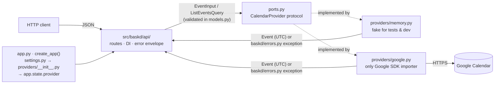

# BASK'D

[](https://github.com/samthropic/BASKD/actions/workflows/ci.yml)

Open Source and Professional Software Development, Fall '26 group project.

A small, complete calendar service: a FastAPI HTTP API in front of a **real calendar
provider (Google Calendar)**, with the provider hidden behind one interface so the same API
also runs against an in-memory fake for fast, deterministic tests.

**Milestone 1, "first working version" (due Oct 7):** *a polished GitHub repository where you
talk to your selected vertical's provider and tests to verify; includes Level 1 and Level 2 of
the specs.* The slice is implemented and tested end to end. The Level definitions themselves
were not available to the team, so [`docs/REQUIREMENTS.md`](docs/REQUIREMENTS.md) records
what we assumed they mean, the questions open with staff, and the acceptance criteria;
[`CHANGELOG.md`](CHANGELOG.md) lists what is in this version.

## Team

- Sam Fiallos
- Arda Dinc
- Bryant Luna-Ramos
- Karthik Ganeshan
- Daniel Zhang

## Documentation map

| Document | What it answers |
| --- | --- |
| this README | How do I run it, what does the API do, why is it built this way |
| [`docs/REQUIREMENTS.md`](docs/REQUIREMENTS.md) | What exactly did we commit to for Levels 1-2, under which assumptions, and how do we know it works |
| [`docs/ARCHITECTURE.md`](docs/ARCHITECTURE.md) | Module-by-module tour, the provider interface, how to add a provider |
| [`docs/HUMAN_STEPS.md`](docs/HUMAN_STEPS.md) | Things only a human can do: Google Cloud project, service account key, sharing the test calendar, GitHub secrets, access/permissions |
| [`docs/DEPLOYMENT.md`](docs/DEPLOYMENT.md) | Running it somewhere other than a laptop (Docker, Cloud Run), configuration and rollback |
| [`docs/NEXT_STEPS.md`](docs/NEXT_STEPS.md) | Prioritised backlog after Milestone 1 (Levels 3+, extensions, process) |
| [`docs/TEAM_AGREEMENT.md`](docs/TEAM_AGREEMENT.md) | How we work together (fill in and accept as a team) |
| [`AGENTS.md`](AGENTS.md) | Development workflow, review and release process; the "what to touch for a given change" map; the instructions coding agents follow in this repo |
| [`CONTRIBUTING.md`](CONTRIBUTING.md) | The five-step version of the above for a first contribution |

## Quick start

Requirements: **Python 3.12** (pinned in `.python-version`) and [`uv`](https://docs.astral.sh/uv/)
(`brew install uv`, `pipx install uv`, or `curl -LsSf https://astral.sh/uv/install.sh | sh`).
`uv` downloads the right Python if you do not have it.

```bash
git clone https://github.com/samthropic/BASKD.git && cd BASKD
uv sync --locked                 # exact dependency versions from uv.lock, into .venv
uv run pytest                    # fast suite; provider tests auto-skip without credentials
BASKD_PROVIDER=memory uv run uvicorn baskd.app:create_app --factory --reload
```

Open <http://127.0.0.1:8000/docs> for the interactive API, or in a second terminal run
`uv run python scripts/demo.py` to watch the create → get → list → replace → delete slice.

To run against the **real Google Calendar**: follow [`docs/HUMAN_STEPS.md`](docs/HUMAN_STEPS.md)
once per team (Google Cloud project, service account, shared test calendar), then

```bash
cp .env.example .env             # set BASKD_GOOGLE_CALENDAR_ID, put the key in secrets/
uv run pytest -m integration     # the same slice against Google; cleans up after itself
uv run uvicorn baskd.app:create_app --factory --reload
```

`make help` lists shortcuts (`make test`, `make lint`, `make typecheck`, `make check`, `make run`,
`make demo`); every target is a one-line `uv` command you can also run directly.

## The API

Interactive docs at `/docs`, OpenAPI JSON at `/openapi.json`. The service is bound to **one**
calendar, chosen by configuration; clients never name a calendar.

| Method & path | Purpose | Success | Errors |
| --- | --- | --- | --- |
| `GET /health` | Liveness; reports which provider is active. Does not call the provider. | `200 {"status":"ok","provider":"google","version":"…"}` | |
| `POST /events` | Create an event | `201` + `Location` header + event | `422` invalid body, `400`, `502`, `503` |
| `GET /events/{id}` | Fetch one event | `200` event | `404`, `502`, `503` |
| `GET /events?from=&to=&limit=&cursor=` | List events overlapping a window, oldest first, paginated | `200 {"items":[…],"next_cursor":"…"\|null}` | `422` bad query, `400` bad cursor, `502`, `503` |
| `PUT /events/{id}` | Replace every client-editable field | `200` event | `404`, `422`, `400`, `502`, `503` |
| `DELETE /events/{id}` | Delete | `204` | `404` (also when already deleted), `502`, `503` |

An event looks like:

```json
{
  "id": "k3m9…",                       // provider-assigned, opaque
  "title": "Sprint planning",
  "start": "2026-10-07T15:00:00Z",     // always UTC in responses
  "end":   "2026-10-07T15:30:00Z",
  "all_day": false,                    // read-only; true for all-day events that already exist in the calendar
  "description": null,
  "location": null,
  "web_link": "https://www.google.com/calendar/event?eid=…"   // link into the provider's UI, if any
}
```

To create or replace one, send `title`, `start`, `end` and optionally `description`, `location`.

`POST /events` creates one timed event on the configured calendar. The provider assigns its
opaque `id`; the response uses UTC timestamps and includes a `Location` header for
`GET /events/{id}`. The operation is **not idempotent**: repeating the same request creates
another event. The read-only `all_day` field is always `false` for events created through this
operation, and `web_link` may be `null` when the active provider does not offer a UI link.

```bash
curl -i http://127.0.0.1:8000/events \
  -H 'Content-Type: application/json' \
  -d '{"title":"Sprint planning","start":"2026-10-07T15:00:00Z","end":"2026-10-07T15:30:00Z"}'
```

Rules every client can rely on (each is enforced by a test):

- **Timestamps in must carry an offset** (`…Z` or `…-04:00`); naive timestamps are rejected
  with `422`, not guessed. **Timestamps out are UTC.** Sub-second precision is dropped.
- `end` must be strictly after `start`. `title` must be non-blank (≤ 1024 chars);
  `description` ≤ 8192 chars and `location` ≤ 1024 chars. Unknown fields in the body or query
  string are rejected (`422`), so a typo like `?form=` cannot silently return the wrong data.
- Listing uses **overlap semantics** on the half-open window `[from, to)`: an event is
  included when `event.end > from` and `event.start < to`. Either bound may be omitted.
  `limit` is 1-250 (default 50); `cursor` is opaque and only valid with the same `from`/`to`.
- `PUT` is a full replacement: optional fields you omit (or send as `null` or `""`) are
  cleared, and the `id` never changes. The body is validated before the event is looked up,
  so an invalid body is `422` even for an unknown id.
- Every error has one shape:
  `{"error": {"code": "<stable_code>", "message": "<human readable>", "details": [...]}}`
  with `details` only on `validation_error`. Codes: `validation_error` (422),
  `invalid_request` (400), `event_not_found` (404), `provider_unavailable` (503, with
  `Retry-After`), `provider_auth_error` and `provider_error` (502), `internal_error` (500).
- URL gotcha: a `+` in a query-string timestamp must be percent-encoded (`%2B`), or use `Z`.

### Provider limitations reflected in the API

Discovered up front and encoded rather than papered over (details in `docs/REQUIREMENTS.md`):

- **No attendees.** A Google service account cannot invite attendees without domain-wide
  delegation, so the API has no attendee field at all instead of one that silently fails.
- **All-day and recurring events can be read, not created.** Existing all-day events show up
  with `all_day: true` and midnight-UTC bounds; recurring events are listed as individual
  occurrences. `PUT` refuses an all-day event or a whole recurring series with
  `400 invalid_request` and leaves it unchanged (otherwise Google would silently turn an
  all-day event into a timed one); a single occurrence, as returned by `GET /events`, can be
  replaced and only that occurrence changes. Creating either is a documented next step.
- **Deleting is not idempotent at the provider**: Google answers 410 for a second delete and
  may return a "cancelled" event on `GET`. Both are reported as `404 event_not_found`.
- **Google answers 404 both for "no such event" and "no such calendar / not shared".** Only
  the former can be a client error, so a 404 from *create* or *list* is reported as
  `502 provider_auth_error` ("calendar not found or not shared"), while a 404 from
  get/replace/delete is `404 event_not_found`.

## Configuration

All settings are environment variables prefixed `BASKD_`, also read from a `.env` file in the
working directory. `.env.example` documents each one.

| Variable | Default | Meaning |
| --- | --- | --- |
| `BASKD_PROVIDER` | `memory` | `google` for the real provider; `memory` keeps events in process (lost on restart) |
| `BASKD_GOOGLE_CALENDAR_ID` | | Required with `google`. The shared test calendar's id (`…@group.calendar.google.com`) |
| `BASKD_GOOGLE_CREDENTIALS_FILE` | | Path to the service-account key JSON (keep it under `secrets/`, which is git-ignored) |
| `BASKD_GOOGLE_CREDENTIALS_JSON` | | Alternative to the file: the key's JSON inline (used by CI) |
| `BASKD_GOOGLE_TIMEOUT_SECONDS` | `10` | Per-call timeout to Google |
| `BASKD_LOG_LEVEL` | `INFO` | Level for the service's own loggers |

The service fails at startup with a readable message when `google` is selected but the
calendar id or credentials are missing.

> **Security note.** The API itself has **no authentication**: anyone who can reach the port
> can edit the calendar the service is bound to. Milestone 1 runs it on `127.0.0.1` only.
> Adding caller authentication is tracked in `docs/NEXT_STEPS.md`; do not expose the service
> publicly before that lands.

## Design in one picture



Requests hit thin FastAPI handlers (`baskd/api`) that depend only on the
`CalendarProvider` interface (`baskd/ports.py`). Input is validated once, at the boundary,
by the strict `EventInput`/`ListEventsQuery` models; output is the tolerant, UTC-normalised
`Event` model (`baskd/models.py`). The concrete provider is chosen once in
`create_app()` (`baskd/app.py`) from settings and injected via `app.state` + `Depends`, so tests
pass the in-memory fake (or a failing stub) straight in. Providers translate their SDK's
failures into a small, provider-neutral exception hierarchy (`baskd/errors.py`) that one set of
exception handlers maps to HTTP. `baskd/providers/google.py` is the only module that imports
the Google SDK. [`docs/ARCHITECTURE.md`](docs/ARCHITECTURE.md) has the full module map, the
request sequence and the error-translation flow; [`AGENTS.md` §6](AGENTS.md#6-map-for-agents-what-to-touch-for-a-given-change)
has a "what to touch for a given change" table for teammates and their coding agents.

## Development

```bash
make check          # ruff check + ruff format --check + mypy (strict) + pytest, same as CI
make fmt            # auto-format and fix
uv run pytest --cov # coverage report (new code is expected to stay ≥ 90%)
```

CI (`.github/workflows/ci.yml`) runs the checks on every push and pull request, runs the real
Google integration tests when the repository secrets are configured (pushes to `main`,
same-repo PRs, manual dispatch), and builds the Docker image. Pushing a `v*` tag drafts a
GitHub Release for a human to review and publish (`.github/workflows/release.yml`).
The workflow itself, including review and release rules, is written down in
[`AGENTS.md`](AGENTS.md).

## License

See [`LICENSE`](LICENSE).
