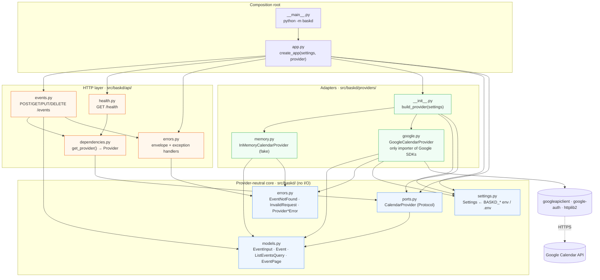
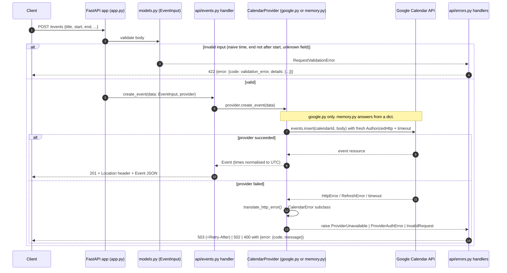
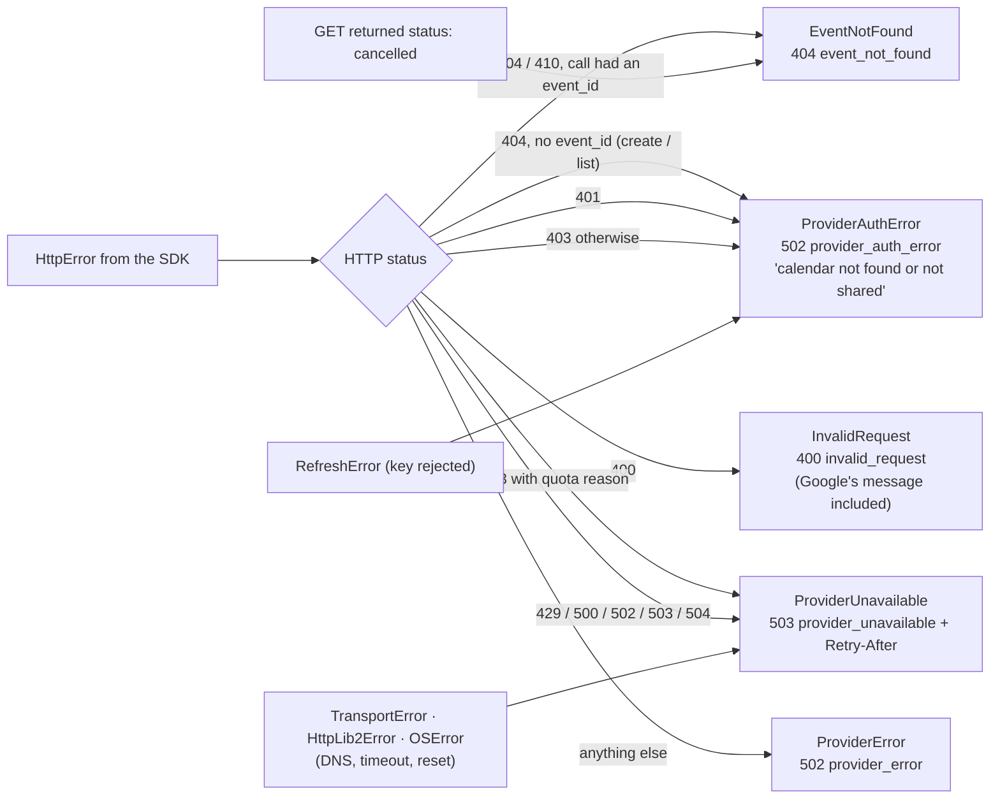

# Architecture

Read this top to bottom once (10 minutes) and you can change any module safely. The type
definitions and function signatures are the overview; the docstrings in the code say what
else you need to know.

**Coding agents and anyone in a hurry:** §0 and §1 are the diagrams; the table in
[`AGENTS.md` §6](../AGENTS.md#6-map-for-agents-what-to-touch-for-a-given-change) says which
files to touch for a given kind of change. Together they should let you make most changes
without opening files you are not going to edit. Diagrams are Mermaid; GitHub renders them,
and they stay readable as plain text.

## 0. Module map and allowed dependencies

Arrows mean "imports". They only ever point from outer layers inward: HTTP → core ← adapters.
Nothing in `api/` or `app.py` may import a concrete provider, and only
`providers/google.py` may import a Google SDK.



Tests mirror the layers: `tests/unit/test_models.py` (core), `test_memory_provider.py` and
`test_google_provider.py` (adapters, the latter with a fake SDK), `test_api_events.py` /
`test_api_errors.py` (HTTP, on the fake provider), `test_settings_and_app.py` (wiring), and
`tests/integration/` (the real Google round trip, self-skipping without credentials).

## 1. The shape of a request



For create, a Google `404` means that the configured calendar does not exist or was not
shared with the service account, so it becomes `502 provider_auth_error`. `404
event_not_found` only applies to operations that address an existing event id.

In words:

1. FastAPI parses and validates the body/query into `EventInput` / `ListEventsQuery`
   (`baskd/models.py`). Anything invalid stops here with a 422 that lists each problem.
2. The handler asks for `provider: Provider` and FastAPI hands it the object stored on
   `app.state` by `create_app()` (`baskd/api/dependencies.py`). Handlers are 1-3 lines.
3. The provider does the work and returns `Event` objects (UTC) or raises one of the
   `baskd.errors` exceptions.
4. Exception handlers registered in `baskd/api/errors.py` turn those into the envelope
   `{"error": {"code", "message", "details?"}}` with the right status.

The other endpoints follow the same path; only the provider method differs
(`get_event`, `list_events`, `replace_event`, `delete_event`). `GET /health` stops at the
handler and never calls the provider.

## 2. Modules

| Module | Responsibility | Depends on |
| --- | --- | --- |
| `baskd/models.py` | The provider-neutral vocabulary: `EventInput` (strict, what clients send), `Event` (tolerant, UTC, what we return), `ListEventsQuery` (window + pagination, with API aliases `from`/`to`), `EventPage` | pydantic |
| `baskd/errors.py` | `CalendarError` hierarchy with a stable `.code`: `EventNotFound`, `InvalidRequest`, `ProviderUnavailable`, `ProviderAuthError`, `ProviderError` | nothing |
| `baskd/ports.py` | `CalendarProvider` protocol: `create_event`, `get_event`, `list_events`, `replace_event`, `delete_event`, `name`. Its docstring is the *contract* every implementation must meet | models |
| `baskd/settings.py` | `Settings` (pydantic-settings, prefix `BASKD_`, reads `.env`). Fails fast if `google` is selected without calendar id/credentials | pydantic-settings |
| `baskd/providers/memory.py` | `InMemoryCalendarProvider`: dict-backed, thread-safe, mirrors Google's overlap/ordering/not-found semantics | models, errors |
| `baskd/providers/google.py` | `GoogleCalendarProvider` + pure helpers: `event_from_google`, `to_google_body`, `merge_into_resource`, `translate_http_error`, `load_credentials`. **The only module that imports Google SDKs** | models, errors, settings, Google SDKs |
| `baskd/providers/__init__.py` | `build_provider(settings)`: the single place that knows every implementation | the above |
| `baskd/api/dependencies.py` | `get_provider` / `Provider` alias: the DI seam | ports |
| `baskd/api/errors.py` | Error envelope models and exception handlers; `STATUS_BY_ERROR` is the one table mapping domain errors to HTTP | errors |
| `baskd/api/events.py`, `baskd/api/health.py` | Routers | models, dependencies |
| `baskd/app.py` | `create_app(settings=None, provider=None)`: wiring, logging, lifespan log line | everything above |
| `baskd/__main__.py` | `python -m baskd` → uvicorn | app |

Rule of thumb: arrows point inward (api → ports/models/errors ← providers). If you find
yourself importing `googleapiclient` outside `providers/google.py`, stop.

## 3. The provider interface, and how it shaped the implementations

```python
class CalendarProvider(Protocol):
    name: str

    def create_event(self, data: EventInput) -> Event: ...
    def get_event(self, event_id: str) -> Event: ...
    def list_events(self, query: ListEventsQuery) -> EventPage: ...
    def replace_event(self, event_id: str, data: EventInput) -> Event: ...
    def delete_event(self, event_id: str) -> None: ...
```

Choices in the interface and what they forced downstream:

- **Validated models in, not raw dicts.** Providers never re-validate; the fake stays
  trivial and the Google provider only maps. Consequence: all validation rules live in
  `models.py`, so the fake and Google can never disagree about what is valid.
- **`Event` out, always UTC.** Google returns times in the calendar's zone; the fake would
  return whatever the client sent. Normalising in the `Event` model (a field validator) means
  every provider agrees for free.
- **`replace_event` takes a full `EventInput`** (not a patch). The fake can rebuild the
  event in one line; Google does fetch → overlay → `events.update`, its documented way to
  edit without clobbering fields we do not manage (reminders, colour, ...). A `PATCH` with
  merge semantics would need the merged result re-validated inside each provider or a second
  fetch in the handler; we deferred it (NEXT_STEPS).
- **Opaque `cursor`.** The fake uses an offset, Google a `nextPageToken`. Clients cannot
  tell and must not care; a cursor is only valid with the same `from`/`to`.
- **Not-found is an exception, not `None`.** Handlers do not branch; one handler maps
  `EventNotFound` → 404 everywhere, including for "already deleted" (Google's 410/cancelled).
- **A provider never leaks its SDK's exceptions.** `_execute()` in the Google provider is the
  one choke point; `translate_http_error` is a pure function with a table-driven test.
- **One calendar per provider instance.** The calendar id is a constructor argument, not a
  method parameter, so the HTTP API has no notion of calendars at all.

### Adding a provider (e.g. Microsoft Graph)

1. Create `baskd/providers/outlook.py` with a class exposing the five methods and `name`.
   Map the SDK's resources to `Event` and its failures to `baskd.errors`.
2. Add settings it needs to `settings.py` (+ fail-fast validation) and a branch in
   `build_provider`.
3. Unit-test the mapping and error translation with a fake SDK object (see
   `tests/unit/test_google_provider.py` for the pattern) and add an auto-skipping module
   under `tests/integration`.
4. Write down the provider's limitations in `docs/REQUIREMENTS.md` §3 and reflect them in the
   API if needed. Nothing in `baskd/api` should change.

## 4. Dependency injection

`create_app()` is the composition root. With no arguments it builds `Settings()` from the
environment and `build_provider(settings)`; tests call
`create_app(settings=Settings(provider="memory", _env_file=None), provider=my_fake)`.
The provider object is stored on `app.state.provider`; `get_provider(request)` returns it and
`Provider = Annotated[CalendarProvider, Depends(get_provider)]` is what handlers declare.
We chose this over FastAPI's `dependency_overrides` because the dependency is a plain
constructor argument, visible in one place, and `app.state` survives across requests without
globals.

## 5. Error model

| Exception (`baskd.errors`) | `code` | HTTP | Raised when |
| --- | --- | --- | --- |
| `EventNotFound` | `event_not_found` | 404 | get/replace/delete of an unknown or deleted id |
| `InvalidRequest` | `invalid_request` | 400 | the provider rejected something we could not validate up front (bad cursor, a Google 400) |
| `ProviderUnavailable` | `provider_unavailable` | 503 + `Retry-After: 5` | timeout, network error, 429, 5xx, quota |
| `ProviderAuthError` | `provider_auth_error` | 502 | 401/403, bad key, calendar not shared |
| `ProviderError` | `provider_error` | 502 | anything else from the provider |
| (FastAPI validation) | `validation_error` | 422 | invalid body/query/path |
| (Starlette `HTTPException`) | `http_error` | as raised | unknown routes, method not allowed |
| (anything else) | `internal_error` | 500 | bug; logged with traceback, message is generic |

How a Google failure becomes one of those (all of this lives in
`providers/google.py::translate_http_error` and `_execute`; the HTTP mapping is the
`STATUS_BY_ERROR` table in `api/errors.py`):



Only `invalid_request` and `provider_auth_error` include text from the provider, and only
Google's `message` field, never URLs or payloads.

## 6. Testing strategy

| Layer | Where | Doubles | Runs |
| --- | --- | --- | --- |
| Models (validation rules) | `tests/unit/test_models.py` | none | always |
| Fake provider contract | `tests/unit/test_memory_provider.py` | none | always |
| HTTP behaviour | `tests/unit/test_api_events.py` | `InMemoryCalendarProvider` | always |
| Error envelope | `tests/unit/test_api_errors.py` | `FailingProvider` (raises on every call) | always |
| Google mapping + translation + request shaping | `tests/unit/test_google_provider.py` | fake `service.events()` returning canned resources / raising `HttpError` | always, offline |
| Configuration & wiring | `tests/unit/test_settings_and_app.py` | throwaway RSA key | always, offline |
| **The real thing** | `tests/integration/test_google_calendar.py` | none | only with credentials; cleans up |

`tests/unit/conftest.py` strips `BASKD_*` from the environment so a teammate's shell
configuration cannot change unit-test outcomes. Integration tests use unique titles and a
cleanup fixture, and CI serialises them (one shared calendar).

## 7. Things we deliberately did not build (yet)

A service layer between handlers and providers (nothing cross-cutting lives there yet;
idempotency and retries will be its first tenants), async handlers, a database, caller
authentication, multi-calendar support, `PATCH`. Each has a line in `docs/NEXT_STEPS.md`
with the trigger that would justify it.
